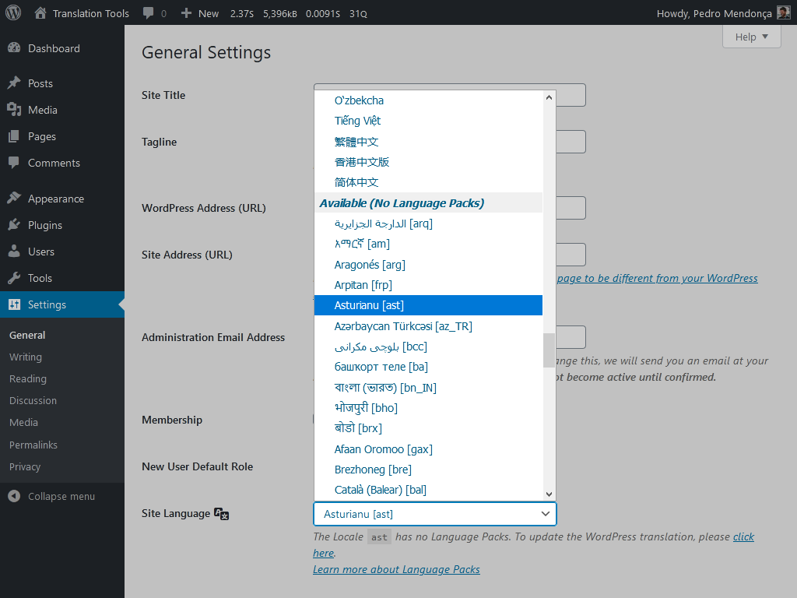
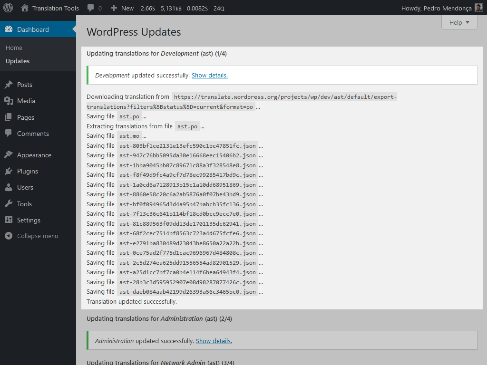
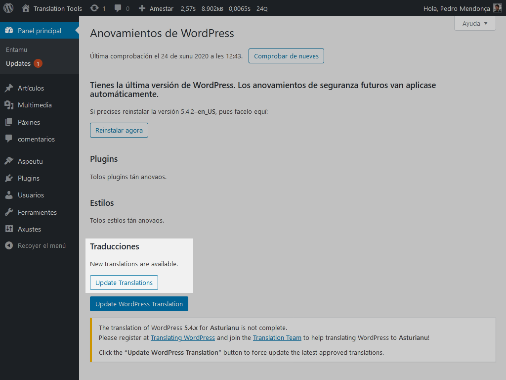
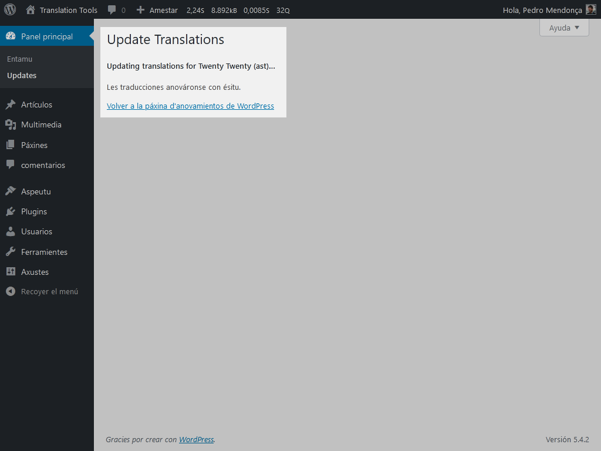

# Translation Tools #

**Contributors:** pedromendonca  
**Donate link:** [github.com/sponsors/pedro-mendonca](https://github.com/sponsors/pedro-mendonca)  
**Tags:** internationalization, i18n, localization, l10n, translation, language packs  
**Requires at least:** 4.9  
**Tested up to:** 5.5  
**Requires PHP:** 5.6  
**Stable tag:** 1.2.1  
**License:** GPLv2  
**License URI:** [http://www.gnu.org/licenses/gpl-2.0.html](http://www.gnu.org/licenses/gpl-2.0.html)  

Translation tools for your WordPress install.

## Description ##

### Use any Locale, with or without Language Packs ###

With core Language Packs you can easily change the language of your WordPress install.  

The Language Packs are only provided for 100% translated Locales.  

If you need a Locale that has no Language Packs yet, this tool helps you by enabling ALL Locales on the list of the available languages.  

### Compatible with plugin [Preferred Languages](https://wordpress.org/plugins/preferred-languages/) ###

The plugin [Preferred Languages](https://wordpress.org/plugins/preferred-languages/) overrides the standard languages field for site and user languages.  

All the features added by Translation Tools are available for Preferred Languages users.  

### Update your WordPress translation, on demand ###

If you need to update your WordPress core translation on demand without waiting for a language pack to be generated, this tool allows you to manually update all the needed files for the installed version, with one click, in a few seconds.  

Go to "Update WordPress Translation" on the Updates screen.  

#### All WordPress core sub-projects ####

*   Development
*   Continents & Cities
*   Administration
*   Network Admin

#### All translation files ####

*   .po (editable translation files)
*   .mo (binary translation files)
*   .json (JavaScript translation files)

## Frequently Asked Questions ##

### Where can I find the full list of WordPress Locales? ###
Here is the complete list of [all WordPress Locales](https://make.wordpress.org/polyglots/teams/).  

### Does my Locale have language packs? ###
Here is a list of the [Locales WITH language packs](https://make.wordpress.org/polyglots/teams/#has-language-pack).  
Here is a list of the [Locales WITH NO language packs](https://make.wordpress.org/polyglots/teams/#no-language-pack).  

### My locale has language packs but the translation isn't complete ###
You can force update the WordPress translation right from your Dashboard > Updates screen.  
Click on the "Update WordPress Translation" and you're done.  
In a few seconds all the needed translation files (.po, .mo and .json) will be generated.  

### I can't use my language in WordPress, themes and plugins because the Locale has no Language Packs ###
Now you can! Just install and activate this plugin to enable every possible Locales and translations.

### My desired Locale doesn't exist in the list ###
If your Locale doesn't exist and you would like to request it, please [click here](https://make.wordpress.org/polyglots/handbook/translating/requesting-a-new-locale/).

### Is this plugin compatible with the plugin Preferred Languages? ###
Short anwser: yes!  
The plugin [Preferred Languages](https://wordpress.org/plugins/preferred-languages/) overrides the standard languages field for site and user languages.  
Since version 1.2.0, this plugin is compatible with Preferred Languages 1.6.0.  
All the features added by Translation Tools are available for Preferred Languages users.  

### Can I help translating this plugin to my own language? ###
Yes you can! If you want to translate this plugin to your language, please [click here](https://translate.wordpress.org/projects/wp-plugins/translation-tools).

### Can I contribute to this plugin? ###
Sure! You are welcome to report any issues or add feature suggestions on the [GitHub repository](https://github.com/pedro-mendonca/Translation-Tools).

## Screenshots ##

1.  Language settings include Locales with NO Language Packs

2.  Button to Update WordPress Translation on demand

3.  Translations of all core sub-projects

4.  Sub-project details and files

5.  Notification of themes and plugins translations updates for Locales with no Language Packs

6.  Automatic theme translation update for Locale with no Language Packs

## Changelog ##

### 1.2.1 ###
*   Fix invalid plugin header on activate

### 1.2.0 ###
*   Include Locales list since [translate.wp.org Languages API](https://translate.wordpress.org/api/languages/) was disabled on meta [changeset #10056](https://meta.trac.wordpress.org/changeset/10056)
*   Compatible with plugin [Preferred Languages](https://wordpress.org/plugins/preferred-languages/) by [Pascal Birchler](https://profiles.wordpress.org/swissspidy/)
*   Update both languages configured in Site and User Language
*   Update the full set of languages configured in plugin [Preferred Languages](https://wordpress.org/plugins/preferred-languages/)

### 1.1.0 ###
*   Improve usability, remove extra steps to add Locales with no Language Packs
*   Remove plugin setting to pre-add a Locale to the main list, all existent languages are now available immediately
*   Language settings now include all Locales, grouped by Language Packs status
*   Language settings are now available for site (General Settings screen) and for users (Profile and User Edit screens)
*   Rename additional available languages to "Native name \[wp_locale\]" format, instead of just the "wp_locale"
*   Link to update WordPress translation on the Site, Profile and User language setting description
*   Localized core update fallback to en_US for Locales with no Language Packs
*   Minor code improvements

### 1.0.1 ###
*   Improve shown info when there are no settings yet
*   Improve shown info when there are no Locales missing Language Packs
*   Improve shown info when the translate.wp.org API is unreachable
*   Minor code improvements

### 1.0.0 ###
*   Initial release.
